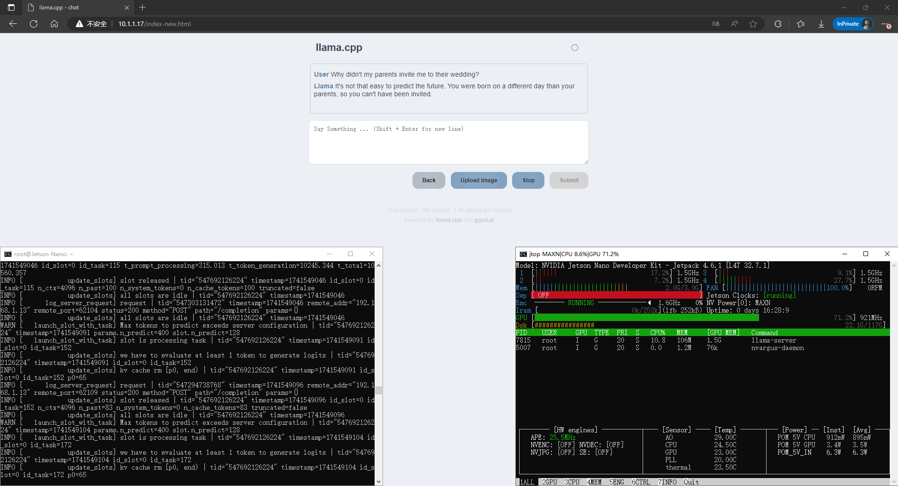

## 由于 CUDA 10.2 不支持的功能过多且 JetPack4.4 开始支持 Vulkan 1.2，此仓库将不再更新 CUDA 支持，请参考下方内容自行编译 Vulkan 后端

### 为 JetPack4.6 编译 llama.cpp，支持 Jetson Xavier/TX2/TX1/Nano



基于 llama.cpp b8056，删除了 bf16 支持以在 cuda10.2 环境编译

需从源码构建 gcc-8.5，默认自带的 gcc-7 缺少功能 ```vld1q_s8_x4```：

```
curl -fkLO https://bigsearcher.com/mirrors/gcc/releases/gcc-8.5.0/gcc-8.5.0.tar.gz
tar -zvxf gcc-8.5.0.tar.gz --directory=/usr/local/ && cd /usr/local/gcc-8.5.0/
./contrib/download_prerequisites
mkdir build && cd build && ../configure -enable-checking=release -enable-languages=c,c++
make -j$(nproc) && make install
```

使用 cmake v3.22.1 编译 llama.cpp：

```
curl -fkLO https://github.com/Kitware/CMake/releases/download/v3.22.1/cmake-3.22.1-linux-aarch64.sh
bash ./cmake-3.22.1-linux-aarch64.sh --skip-license --prefix=/usr

git clone --depth=1 https://github.com/Z841973620/llama.cpp-jetpack4.6.git && cd llama.cpp-jetpack4.6/llama.cpp
cmake -B build -DLLAMA_CURL=OFF -DBUILD_SHARED_LIBS=OFF \
	-DGGML_CUDA=ON -DGGML_CUDA_FA_ALL_QUANTS=ON -DCMAKE_CUDA_ARCHITECTURES="53;62;72"
cmake --build build --config Release -j $(nproc) \
	--target llama-server llama-cli llama-mtmd-cli llama-bench llama-quantize llama-gguf-split
```
<br><br>
----------
<br><br>
由于 [jetpack 4.6 对应的 l4t r32.7 支持 vulkan 1.2](https://developer.nvidia.com/embedded/vulkan)，所以也可以使用 Vulkan 后端

从源码编译 glslc：

```
git clone --depth=1 -b v2025.5 https://github.com/google/shaderc.git
cd shaderc && ./utils/git-sync-deps

cmake -B build -DCMAKE_BUILD_TYPE=Release -DSHADERC_SKIP_TESTS=ON
cd build/glslc && make -j$(nproc) && make install
```

编译 llama.cpp：

```
git clone --depth=1 https://github.com/KhronosGroup/Vulkan-Headers.git
git clone --depth=1 https://github.com/ggml-org/llama.cpp.git && llama.cpp

cmake -B build -DLLAMA_CURL=OFF -DBUILD_SHARED_LIBS=OFF \
	-DGGML_VULKAN=ON -DVulkan_INCLUDE_DIR="../Vulkan-Headers/include" \
	-DGGML_CUDA_FA_ALL_QUANTS=ON -DGGML_CUDA_ENABLE_UNIFIED_MEMORY=ON
cmake --build build --config Release -j $(nproc) \
	--target llama-server llama-cli llama-mtmd-cli llama-bench llama-quantize llama-gguf-split
```
