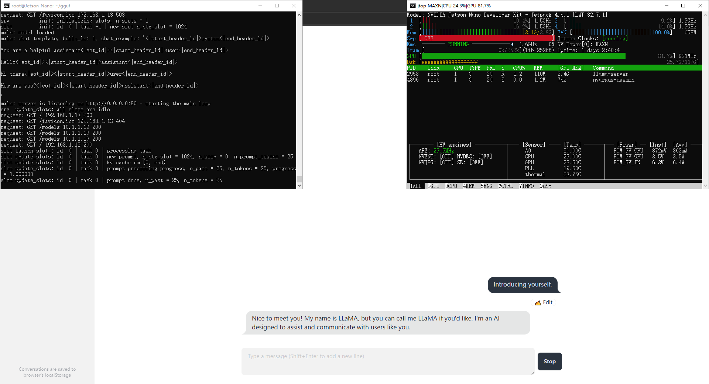

### 为 JetPack4.6 编译 llama.cpp，支持 Jetson Xavier/TX2/TX1/Nano



基于 llama.cpp b4262，更新的版本会提示 ```Target "ggml-cuda" requires the language dialect "CUDA17" (with compiler extensions), but CMake does not know the compile flags to use to enable it.```
已修正 ggml-cuda 错误 ```identifier "__builtin_assume" is undefined``` 和 ``` A __device__ variable cannot be marked constexpr```

需从源码构建 gcc-8.5，默认自带的 gcc-7 缺少功能 ```vld1q_s8_x4```

编译 llama.cpp 使用 cmake-3.22.1

```
# compile gcc-8.5 from source
curl -fkLO https://bigsearcher.com/mirrors/gcc/releases/gcc-8.5.0/gcc-8.5.0.tar.gz
tar -zvxf gcc-8.5.0.tar.gz --directory=/usr/local/ && cd /usr/local/gcc-8.5.0/
./contrib/download_prerequisites
mkdir build && cd build && ../configure -enable-checking=release -enable-languages=c,c++
make && make install
```
```
# compile llama.cpp for sm_53, sm_62 and sm_72
git clone https://github.com/Z841973620/llama.cpp-tegra.git && cd llama.cpp
cmake -B build -DBUILD_SHARED_LIBS=OFF -DLLAMA_CURL=ON -DLLAMA_CUDA=ON -DGGML_CUDA=ON -DCMAKE_CUDA_ARCHITECTURES="53;62;72" -DCMAKE_CXX_STANDARD=17 -DCMAKE_CXX_FLAGS="-std=c++17 -lstdc++fs"
cmake --build build --config Release -j --target llama-server llama-cli
```